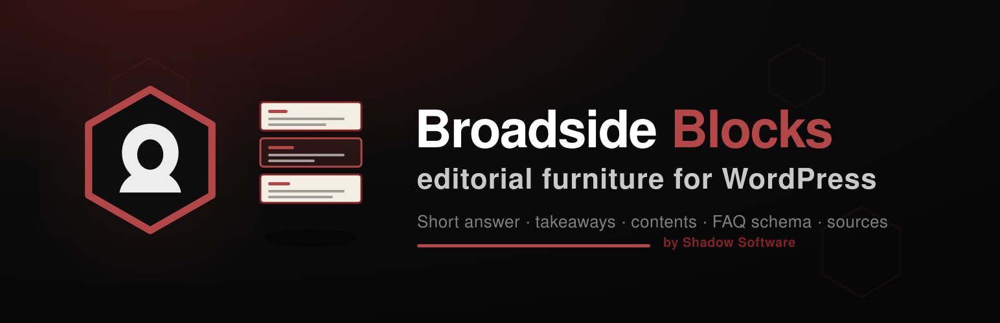

  

<h1 align="center">Broadside Blocks</h1>

  <strong>The editorial furniture a newspaper needs, as WordPress blocks.</strong> 
  A short-answer box, key takeaways, a table of contents that builds itself, an FAQ
  that emits schema, a sources list — and the masthead a broadsheet is printed under.

  
  
  
  

---

> ### 📰 This plugin is one half of [**Broadside**](https://github.com/shadow-software/broadside-theme-for-wordpress)
>
> The theme is the paper: the type, the grid, the colour, the templates.
> **This plugin is what is printed on it** — the nameplate, the folio rule, the
> bylines, and every editorial block.
>
> They ship together and they are not much use apart. Activate the theme and
> WordPress 6.5+ offers this plugin automatically (`Requires Plugins: broadside-blocks`).

---

## Why is this a plugin and not part of the theme?

Because WordPress is right about this, and we found out the hard way — the theme was
rejected from the WordPress.org directory for exactly this:

> **REQUIRED:** The theme uses the `register_block_type()` function… `register_block_type()`
> is plugin-territory functionality and must not be used in themes. Use a plugin instead.

The rule's test is a good one, and worth internalising rather than merely complying with:

> Themes handle **presentation**. Plugins handle **content**.
> **Anything a user loses when they switch themes belongs in a plugin.**

A Short Answer, an FAQ, a Sources list — that is *content*. It lives in `post_content`.
Ship it inside a theme and changing theme silently blanks a reader's FAQ, with no way
to get it back. The rule exists to protect the user from precisely that.

## What is in it

**Editorial blocks** — the furniture a reported feature actually needs:

| Block | What it does |
|---|---|
| **Short Answer** | A direct, quotable answer at the top — for the reader in a hurry and the search engine that wants to cite you. |
| **Key Takeaways** | The three or four things a reader should leave with. |
| **Table of Contents** | Builds itself from your headings. Rename a heading and the contents follow. |
| **FAQ** | Questions and answers that also emit valid `FAQPage` structured data. |
| **Sources & References** | The receipts. |
| **Disclosure Table** | A comparison table whose partner links are *always* `rel="sponsored nofollow"`, and which refuses to render without a disclosure line. |

**Masthead furniture** — nameplate, folio rule, utility bar, colophon, byline, author
bio, editorial standards, newsletter panel, section grid, related stories, lead well.

## Under another theme

Nothing renders, and nothing fatals.

Every block calls helpers that live in the theme, and every render callback passes
through a single guard that checks the theme is there first. Without Broadside the
blocks return empty, WordPress omits them, the page is whole, and an admin notice
explains why. A plugin that white-screens a stranger's site when they switch themes is
a bad plugin.

## Licence

GPL-2.0-or-later. It bundles no third-party code, no images, no icons and no
JavaScript libraries.

---

## Also by Shadow Software

**WordPress & WooCommerce**

| | |
|---|---|
| [**Broadside**](https://github.com/shadow-software/broadside-theme-for-wordpress) | A broadsheet block theme for WordPress — blackletter masthead, folio rule, three-column lead grid. |
| [**Broadside Blocks**](https://github.com/shadow-software/broadside-blocks-for-wordpress) | The editorial furniture that ships with it — short answer, takeaways, contents, FAQ schema, sources. |
| [**Crypto for WooCommerce**](https://github.com/shadow-software/crypto-for-woocommerce) | Free, self-custodial crypto payments — ETH, USDC, USDT & Bitcoin, confirmed on-chain. [On WordPress.org →](https://wordpress.org/plugins/shadow-software-crypto-for-woocommerce/) |
| [**AGT for WooCommerce**](https://github.com/shadow-software/agt-for-woocommerce) | Sync your WooCommerce store with your American Gun Trader dealer listings. |

**n8n**

We run our automation on [n8n](https://n8n.io), and publish the nodes we had to build for it:

| | |
|---|---|
| [**n8n-nodes-huggingface-space**](https://github.com/shadow-software/n8n-nodes-huggingface-space) | Run inference on any Hugging Face Gradio Space from n8n — images, video, music, speech, text and moderation, with a curated model catalog and automatic fallbacks. |
| [**n8n-nodes-custom-exec-node**](https://github.com/shadow-software/n8n-nodes-custom-exec-node) | Brings back `bash` in n8n, which v2.0 removed. |

  <a href="https://shadowsoftware.com/">shadowsoftware.com</a> · GPL-2.0-or-later · © 2026 Shadow Software LLC

